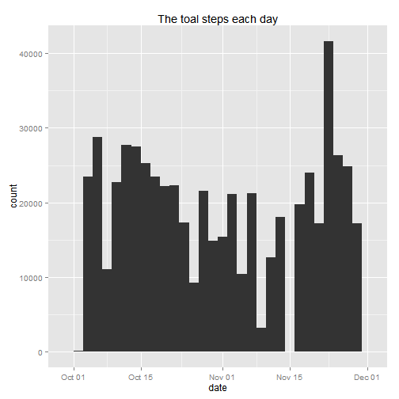
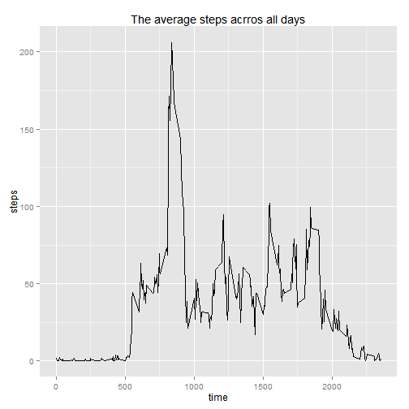
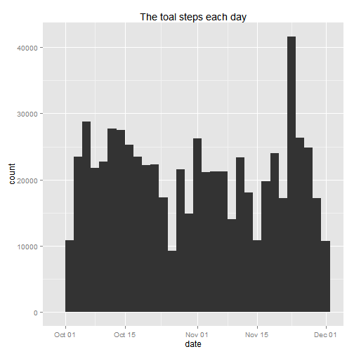
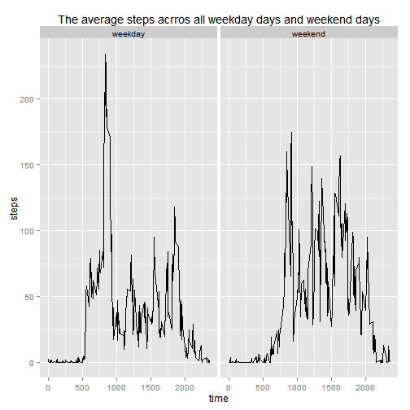

Starts with the assumption that the dataset file is available in the working directory and the dplyr, lubridate and ggplot2 package are installed.

## Loading and preprocessing the data

1.Read the data and change to tbl-df format

```r
library(dplyr)
```

```
## 
## Attaching package: 'dplyr'
## 
## The following object is masked from 'package:stats':
## 
##     filter
## 
## The following objects are masked from 'package:base':
## 
##     intersect, setdiff, setequal, union
```

```r
data <- read.csv("activity.csv", stringsAsFactors = F)
```

```
## Warning in file(file, "rt"): cannot open file 'activity.csv': No such file
## or directory
```

```
## Error in file(file, "rt"): cannot open the connection
```

```r
data <- tbl_df(data)
head(data)
```

```
## Source: local data frame [6 x 4]
## 
##   steps       date interval weekday
## 1    NA 2012-10-01        0 weekday
## 2    NA 2012-10-01        5 weekday
## 3    NA 2012-10-01       10 weekday
## 4    NA 2012-10-01       15 weekday
## 5    NA 2012-10-01       20 weekday
## 6    NA 2012-10-01       25 weekday
```

2.Change the date variable to date format


```r
Sys.setlocale("LC_TIME", "English")
```

```
## [1] "English_United States.1252"
```

```r
library(lubridate)
data$date <- ymd(data$date)
class(data$date)
```

```
## [1] "POSIXct" "POSIXt"
```


## What is mean total number of steps taken per day?

1.Calculate the total number of stpes taken per day


```r
steps.per.day <- summarise(group_by(data, date), sum(steps))
names(steps.per.day) <- c("date", "total.steps")
summary(steps.per.day)
```

```
##       date             total.steps   
##  Min.   :2012-10-01   Min.   :   41  
##  1st Qu.:2012-10-16   1st Qu.: 8841  
##  Median :2012-10-31   Median :10765  
##  Mean   :2012-10-31   Mean   :10766  
##  3rd Qu.:2012-11-15   3rd Qu.:13294  
##  Max.   :2012-11-30   Max.   :21194  
##                       NA's   :8
```

2.Create a histogram


```r
library(ggplot2)
qplot(date, data = steps.per.day, weight = total.steps, geom="histogram",
      main = "The toal steps each day")
```

```
## stat_bin: binwidth defaulted to range/30. Use 'binwidth = x' to adjust this.
```

 

3.Calculate the mean and median of the total number of steps per day


```r
summarise(steps.per.day, mean(total.steps, na.rm = TRUE), median(total.steps, na.rm = TRUE))
```

```
## Source: local data frame [1 x 2]
## 
##   mean(total.steps, na.rm = TRUE) median(total.steps, na.rm = TRUE)
## 1                        10766.19                             10765
```


## What is the average daily activity pattern?

1.Create a plot of the 5-minute interval and the average number of steps across all days


```r
steps.across.day <- summarise(group_by(data, interval), mean(steps, na.rm = TRUE))
names(steps.across.day) <- c("time", "steps")
qplot(time, steps, data = steps.across.day, geom = "line",
      main = "The average steps acrros all days")
```

 

2.The maximum number of steps across the days


```r
steps.across.day[which(with(steps.across.day, steps == max(steps, na.rm = TRUE))), ]
```

```
## Source: local data frame [1 x 2]
## 
##   time    steps
## 1  835 206.1698
```

## Imputing missing values

1.Calculate the total number of missing values in the dataset.


```r
sum(is.na(data))
```

```
## [1] 2304
```

2.Devise a strategy for filling the missing values in the dataset.

**Use the means for the 5-minute intervals as fillers for missing values.**

3.Create a new dataset that the missing data filled in.


```r
filldata <- merge(data, steps.across.day, by.x = "interval", by.y = "time",
                  suffixes = c("", ".new"))
filldata$steps[is.na(filldata$steps)] <- filldata$steps.new[is.na(filldata$steps)]
filldata <- filldata[, c(1:3)]
```

4.Create a histogram and Calculate the mean and median


```r
fill.steps.per.day <- summarise(group_by(filldata, date), sum(steps, na.rm = TRUE))
names(fill.steps.per.day) <- c("date", "total.steps")
qplot(date, data = fill.steps.per.day, weight = total.steps, geom="histogram",
      main = "The toal steps each day")
```

```
## stat_bin: binwidth defaulted to range/30. Use 'binwidth = x' to adjust this.
```

 

```r
summarise(fill.steps.per.day, mean(total.steps), median(total.steps))
```

```
## Source: local data frame [1 x 2]
## 
##   mean(total.steps) median(total.steps)
## 1          10766.19            10766.19
```

5.How much is the impact of imputing missing data

* Original data

```r
summarise(steps.per.day, mean(total.steps, na.rm = TRUE), median(total.steps, na.rm = TRUE))
```

```
## Source: local data frame [1 x 2]
## 
##   mean(total.steps, na.rm = TRUE) median(total.steps, na.rm = TRUE)
## 1                        10766.19                             10765
```

* Imputing data

```r
summarise(fill.steps.per.day, mean(total.steps), median(total.steps))
```

```
## Source: local data frame [1 x 2]
## 
##   mean(total.steps) median(total.steps)
## 1          10766.19            10766.19
```


**The impact of imputing missing data seems low**


## Are there differences in activity patterns between weekdays and weekends?

1.Create the weekday variable in the dataset with two levels-"weekday" and "weekend"


```r
data$weekday <- "weekday"
data$weekday[weekdays(data$date) == "Saturday"] <- "weekend"
data$weekday[weekdays(data$date) == "Sunday"] <- "weekend"
```

2.Create a plot of 5-minute interval and the average number of steps across all weekday days and weekend days


```r
steps.across.weekday <- summarise(group_by(data, interval, weekday),
                                  mean(steps, na.rm = TRUE))
names(steps.across.weekday) <- c("time", "weekday", "steps")
qplot(time, steps, data = steps.across.weekday, geom = "line", facets = . ~ weekday,
      main = "The average steps acrros all weekday days and weekend days")
```

 
